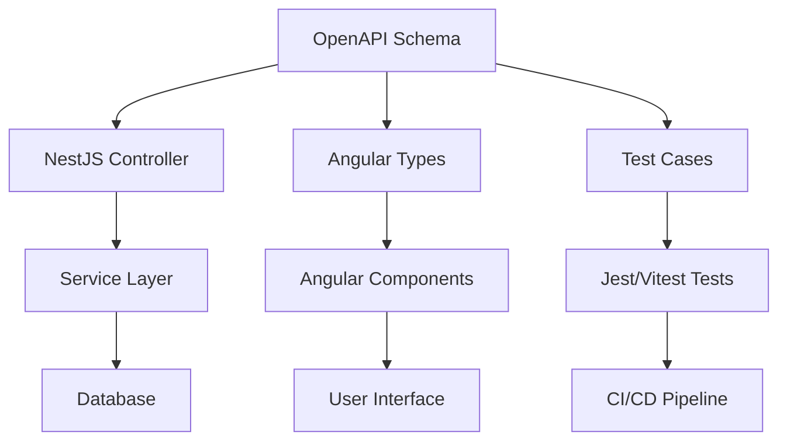

# 01. スキーマ駆動開発 + TDD 全体概要

## スキーマ駆動開発とは

スキーマ駆動開発は、API 仕様（スキーマ）を最初に定義し、そのスキーマから型定義やバリデーションロジック、テストケースを自動生成する開発手法です。

### 従来の開発フロー

```
実装 → テスト → ドキュメント → 型定義
```

### スキーマ駆動開発のフロー

```
スキーマ定義 → 型定義生成 → テスト生成 → 実装
```

## TDD との統合戦略

### 拡張された Red-Green-Refactor サイクル

#### 1. Schema First（スキーマファースト）

```yaml
# OpenAPI仕様を先に定義
paths:
  /users:
    get:
      responses:
        '200':
          content:
            application/json:
              schema:
                type: array
                items:
                  $ref: '#/components/schemas/User'
```

#### 2. Red（失敗するテストを書く）

```typescript
// スキーマに基づくテストを先に作成
describe('UsersController', () => {
  it('should return users array matching schema', async () => {
    const result = await controller.findAll();
    expect(result).toMatchSchema(UserArraySchema);
  });
});
```

#### 3. Green（テストをパスする最小限の実装）

```typescript
// 最小限の実装でテストをパス
@Controller('users')
export class UsersController {
  @Get()
  async findAll(): Promise<UserDto[]> {
    return []; // 最小限の実装
  }
}
```

#### 4. Refactor（リファクタリング）

```typescript
// 実際の実装に改善
@Controller('users')
export class UsersController {
  constructor(private readonly usersService: UsersService) {}

  @Get()
  async findAll(): Promise<UserDto[]> {
    return this.usersService.findAll();
  }
}
```

## アーキテクチャ概要

### 技術スタック統合



### ファイル構成例

```
apps/
├── backend/
│   ├── src/
│   │   ├── schemas/           # OpenAPI仕様
│   │   │   └── user.schema.yaml
│   │   ├── dto/              # 自動生成されるDTO
│   │   │   └── user.dto.ts
│   │   ├── controllers/       # コントローラー
│   │   │   └── users.controller.ts
│   │   └── services/         # サービス
│   │       └── users.service.ts
├── frontend/
│   ├── src/
│   │   ├── types/            # 自動生成される型定義
│   │   │   └── api.types.ts
│   │   └── services/         # HTTPクライアント
│   │       └── api.service.ts
└── shared/
    └── schemas/              # 共通スキーマ定義
```

## 開発フロー概要

### Phase 1: スキーマ設計

1. **ドメイン分析**: ビジネス要件を分析
2. **API 設計**: RESTful API の設計
3. **スキーマ定義**: OpenAPI 仕様の作成

### Phase 2: バックエンド開発（TDD）

1. **型生成**: スキーマから DTO 自動生成
2. **テスト作成**: スキーマベースのテスト作成
3. **実装**: TDD サイクルでの実装

### Phase 3: フロントエンド開発（TDD）

1. **型生成**: スキーマから TypeScript 型生成
2. **サービス作成**: HTTP 通信サービス作成
3. **コンポーネント実装**: TDD でのコンポーネント実装

### Phase 4: 統合・検証

1. **契約テスト**: API とフロントエンドの契約検証
2. **E2E テスト**: エンドツーエンドのテスト
3. **パフォーマンステスト**: 負荷テスト

## 品質保証戦略

### 自動検証レイヤー

1. **スキーマレベル**: OpenAPI 仕様の妥当性検証
2. **型レベル**: TypeScript の型チェック
3. **実行時レベル**: class-validator でのバリデーション
4. **テストレベル**: 単体・統合・E2E テスト

### CI/CD パイプライン統合

```yaml
# GitHub Actions例
steps:
  - name: Schema Validation
    run: swagger-codegen validate schema.yaml

  - name: Generate Types
    run: npm run generate:types

  - name: Run Tests
    run: npm run test

  - name: Build Applications
    run: npm run build
```

## メリットと期待効果

### 開発効率向上

- **型安全性**: コンパイル時のエラー検出
- **自動生成**: 手動での型定義作業削減
- **ドキュメント同期**: API ドキュメントの自動更新

### 品質向上

- **契約保証**: フロントエンドとバックエンドの契約
- **一貫性**: スキーマ準拠の強制
- **テスト網羅性**: スキーマベースの包括的テスト

### チーム協業

- **明確な仕様**: 共通理解の促進
- **並行開発**: フロントエンド・バックエンドの並行開発
- **レビュー効率**: スキーマレビューでの早期問題発見
