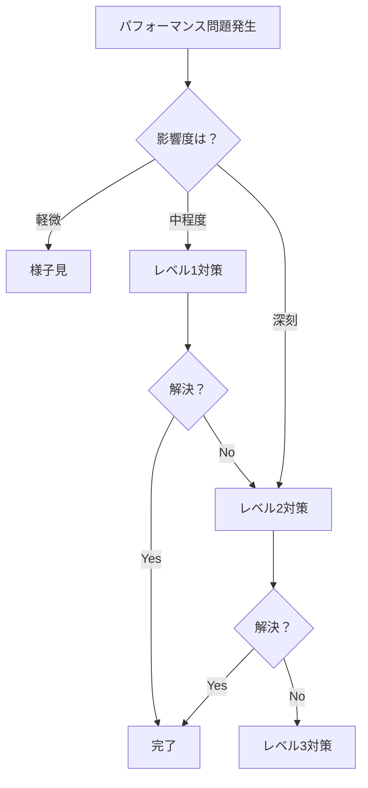

# フェーズ 5: パフォーマンス最適化（必要時のみ）

## 概要

YAGNI原則に従い、**実際にパフォーマンス問題が発生した場合のみ**対応する。
早過ぎる最適化は避け、ユーザー体験に影響が出た時点で必要最小限の改善を行う。

## パフォーマンス問題の判定基準

### 対応が必要な状況

- [ ] **初回表示が3秒以上かかる**
- [ ] **コマンド入力に遅延を感じる**（100ms以上）
- [ ] **スクロールがカクつく**（60fps未満）
- [ ] **メモリ使用量が1GB超える**
- [ ] **CPU使用率が常時50%以上**

## 段階的対応策

### レベル1: 簡単な改善（問題発生時に最初に試す）

#### 1.1 遅延読み込み

- [ ] **条件**: 初回表示が遅い場合
- [ ] **対策**: 
  ```typescript
  // ルートレベルで遅延読み込み
  loadChildren: () => import('./features/chat/chat.module')
    .then(m => m.ChatModule)
  ```

#### 1.2 Change Detection最適化

- [ ] **条件**: 不要な再描画が多い場合
- [ ] **対策**: OnPushストラテジー適用
  ```typescript
  @Component({
    changeDetection: ChangeDetectionStrategy.OnPush
  })
  ```

### レベル2: 中程度の改善（レベル1で解決しない場合）

#### 2.1 仮想スクロール

- [ ] **条件**: 大量のログでスクロールが重い
- [ ] **対策**: CDK Virtual Scrolling導入
  ```typescript
  <cdk-virtual-scroll-viewport itemSize="20">
    <div *cdkVirtualFor="let item of items">{{item}}</div>
  </cdk-virtual-scroll-viewport>
  ```

#### 2.2 WebWorker活用

- [ ] **条件**: 重い処理でUIがブロックされる
- [ ] **対策**: 
  - ANSI処理をWebWorkerで実行
  - マークダウンパースをWorkerで処理

### レベル3: 本格的な最適化（深刻な問題の場合のみ）

#### 3.1 メモリリーク対策

- [ ] **条件**: 長時間使用でメモリが増え続ける
- [ ] **対策**:
  - Subscription管理徹底
  - DOMクリーンアップ
  - 履歴データの制限

#### 3.2 バンドルサイズ削減

- [ ] **条件**: 初回ロードが遅すぎる
- [ ] **対策**:
  - Tree shaking最適化
  - 不要なライブラリ削除
  - 動的インポート活用

## 計測と監視

### パフォーマンス計測（問題報告時のみ実施）

```typescript
// 簡易パフォーマンス計測
class PerformanceMonitor {
  measure(name: string, fn: () => void) {
    const start = performance.now();
    fn();
    const duration = performance.now() - start;
    if (duration > 100) {
      console.warn(`${name} took ${duration}ms`);
    }
  }
}
```

## 削除した項目（YAGNI原則）

以下の最適化は実際に必要になるまで実装しない：

### 実装しない最適化

- **Service Worker**: オフライン対応が不要
- **サーバーサイドレンダリング（SSR）**: SPAで十分
- **Progressive Web App（PWA）**: デスクトップ利用前提
- **CDN配信**: ローカル環境メイン
- **圧縮アルゴリズム最適化**: 標準gzipで十分
- **カスタムビルドツール**: Viteで十分高速
- **メモリプール管理**: V8に任せる
- **カスタムレンダリングエンジン**: 標準DOMで十分
- **WebAssembly**: JavaScriptで十分高速
- **GPU処理**: 不要なオーバーヘッド

## 対応フロー



## チェックリスト（問題発生時のみ使用）

### 調査項目

- [ ] Chrome DevToolsでパフォーマンス計測
- [ ] Memory Profilerでメモリリーク確認
- [ ] Network タブでバンドルサイズ確認
- [ ] Lighthouse スコア確認

### 改善確認項目

- [ ] 改善前後でメトリクス比較
- [ ] ユーザー体験が改善されたか確認
- [ ] 新たな問題が発生していないか確認

## 重要な原則

1. **計測なしに最適化しない**
2. **問題がない箇所は触らない**
3. **ユーザー体験を最優先**
4. **シンプルな解決策を選ぶ**
5. **過度な最適化は技術的負債**

## まとめ

パフォーマンス最適化は**必要悪**として扱う。
問題が発生してから、計測に基づいて、最小限の変更で対応する。
早すぎる最適化は複雑性を増し、開発速度を落とすだけ。