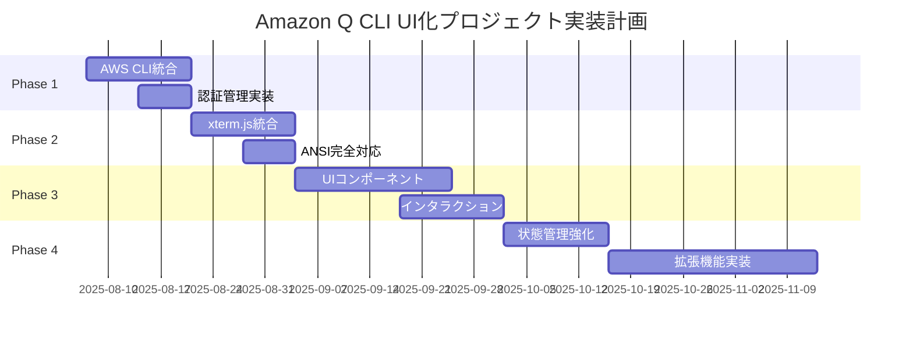

# 🎯 Amazon Q CLI UI化プロジェクト実現可能性評価レポート

## エグゼクティブサマリー

調査の結果、**Amazon Q CLIのUIベース化とCrushのようなUI/UX実現は技術的に十分可能**と判断しました。現在のプロジェクト基盤（Angular/NestJS + WebSocket/PTY）は適切に選択されており、目標達成に向けた拡張が可能です。

## 1. 現状分析

### 1.1 Amazon Q CLI の特徴
- **エージェント型AI**: Claude 3.7 Sonnetを搭載し、ファイル読み書き、AWS API呼び出し、コマンド実行を自動化
- **自然言語処理**: 自然言語をシェルコマンドに変換
- **マルチターン会話**: コンテキストを保持した対話型インタラクション
- **AWS統合**: DynamoDB、S3等のAWSリソースとの密接な連携

### 1.2 Crush の UI/UX 特徴
- **ターミナルベースUI**: Goのbubbletea/lipglossによる洗練されたTUI
- **マルチモデル対応**: 複数のLLMを切り替えて使用可能
- **セッション管理**: 会話履歴の保存と再開
- **拡張性**: MCPによるツール拡張

### 1.3 現在のプロジェクト状況

#### 実装済み機能
- ✅ WebSocket通信基盤（フロントエンド⇔バックエンド）
- ✅ PTYプロセス管理（コマンド実行）
- ✅ 基本的なコマンド入力UI
- ✅ メッセージ表示コンポーネント
- ✅ 基本的なANSI処理（カラー対応）
- ✅ ヘルスチェックAPI
- ✅ E2E接続確立

#### 技術スタック
- **フロントエンド**: Angular 20.1 + PrimeNG + Tailwind CSS
- **バックエンド**: NestJS 11 + Socket.io + node-pty
- **開発環境**: Nx モノレポ + TypeScript 5.8

## 2. 技術的実現可能性評価

### 2.1 コア機能の実現性

| 機能 | 実現可能性 | 現状 | 必要な作業 |
|------|------------|------|------------|
| Amazon Q CLI統合 | ⭐⭐⭐⭐⭐ 高 | PTY基盤あり | AWS CLIラッパー実装 |
| リアルタイムコマンド実行 | ⭐⭐⭐⭐⭐ 高 | 実装済み | - |
| AI応答の構造化表示 | ⭐⭐⭐⭐⭐ 高 | 基本表示あり | マークダウン処理追加 |
| ターミナルエミュレーション | ⭐⭐⭐⭐ 中高 | 基本実装あり | xterm.js統合 |
| セッション管理 | ⭐⭐⭐⭐ 中高 | 未実装 | 状態管理追加 |

### 2.2 UI/UX実現性

| 要素 | 実現可能性 | 推奨技術 | 備考 |
|------|------------|----------|------|
| Crush風モダンUI | ⭐⭐⭐⭐⭐ 高 | PrimeNG + カスタムCSS | PrimeNGコンポーネントで実現可能 |
| スムーズなアニメーション | ⭐⭐⭐⭐⭐ 高 | Angular Animations | 標準機能で対応 |
| テーマシステム | ⭐⭐⭐⭐⭐ 高 | CSS変数 + Angular | 基本実装あり |
| レスポンシブデザイン | ⭐⭐⭐⭐⭐ 高 | Tailwind CSS | 設定済み |

## 3. 必要な追加実装項目

### Phase 1: Amazon Q CLI基本統合（2-3週間）

#### 3.1.1 AWS CLI統合サービス
```typescript
// 実装イメージ
interface AmazonQService {
  // Amazon Q CLIコマンド実行
  executeQCommand(command: string): Observable<CommandOutput>;
  
  // コマンド補完候補取得
  getCommandSuggestions(input: string): Observable<string[]>;
  
  // AI応答の構造化処理
  handleAIResponse(response: AIResponse): ProcessedResponse;
  
  // AWS認証管理
  configureAWSCredentials(credentials: AWSCredentials): void;
}
```

#### 3.1.2 必要なバックエンド拡張
- AWS SDK統合
- Amazon Q特有のコマンドパーサー
- 認証情報の安全な管理
- ストリーミング応答の処理

### Phase 2: 高度なターミナル機能（3-4週間）

#### 3.2.1 xterm.js統合
```typescript
// 現在の基本表示を高機能ターミナルへ
interface TerminalService {
  // xterm.jsインスタンス管理
  createTerminal(options: ITerminalOptions): Terminal;
  
  // PTYとの双方向バインディング
  attachToPty(terminal: Terminal, ptyProcess: IPty): void;
  
  // ターミナルリサイズ対応
  handleResize(cols: number, rows: number): void;
}
```

#### 3.2.2 ANSI完全対応
- 全カラーコード対応
- カーソル制御
- 画面クリア
- 文字装飾（太字、下線等）

### Phase 3: Crush風UI/UX実装（4-5週間）

#### 3.3.1 UIコンポーネント強化
```typescript
// PrimeNGを活用したモダンUI
components/
├── command-palette/        # Cmd+K風コマンドパレット
├── split-terminal/         # 分割可能なターミナル
├── ai-response-viewer/     # AI応答の美しい表示
├── session-manager/        # セッション管理UI
└── settings-panel/         # 設定パネル
```

#### 3.3.2 インタラクション強化
- キーボードショートカット
- ドラッグ&ドロップ
- コンテキストメニュー
- インラインサジェスト

### Phase 4: 高度な機能（6-8週間）

#### 3.4.1 状態管理強化
```typescript
// NgRxまたはAkitaによる状態管理
interface AppState {
  sessions: SessionState[];
  terminal: TerminalState;
  ai: AIAssistantState;
  settings: SettingsState;
}
```

#### 3.4.2 拡張機能
- MCP (Model Context Protocol) 対応
- プラグインシステム
- カスタムテーマエディタ
- エクスポート機能

## 4. 実装ロードマップ



## 5. リスクと対策

### 5.1 技術的リスク

| リスク | 影響度 | 発生確率 | 対策 |
|--------|--------|----------|------|
| AWS認証の複雑性 | 高 | 中 | AWS SDK best practicesに従う |
| パフォーマンス劣化 | 中 | 低 | 仮想スクロール、遅延読み込み |
| ブラウザ互換性 | 低 | 低 | モダンブラウザに限定 |

### 5.2 プロジェクトリスク

| リスク | 影響度 | 発生確率 | 対策 |
|--------|--------|----------|------|
| スコープクリープ | 高 | 中 | YAGNI原則の徹底 |
| 複雑度の増大 | 中 | 中 | 段階的実装、定期的リファクタリング |

## 6. 推奨事項

### 6.1 即座に実施すべき事項

1. **xterm.jsのプロトタイプ作成**
   - 現在の基本表示では限界がある
   - プロフェッショナルな見た目の実現に必須

2. **Amazon Q CLI動作検証**
   - ローカル環境でのAmazon Q CLI動作確認
   - 必要なAPIエンドポイントの洗い出し

3. **セキュリティ設計**
   - AWS認証情報の管理方針決定
   - コマンド実行の権限制御設計

### 6.2 アーキテクチャ推奨

```typescript
// 推奨アーキテクチャ
architecture/
├── presentation/     # Angular Components + PrimeNG
│   ├── terminal/    # xterm.js統合
│   ├── ai-chat/     # AI対話UI
│   └── settings/    # 設定管理
├── application/     # ビジネスロジック
│   ├── amazon-q/    # Amazon Q統合
│   ├── session/     # セッション管理
│   └── terminal/    # ターミナル制御
├── infrastructure/  # 外部連携
│   ├── websocket/   # リアルタイム通信
│   ├── aws/         # AWS SDK
│   └── pty/         # プロセス管理
└── domain/          # ドメインモデル
    ├── models/      # データモデル
    └── interfaces/  # インターフェース定義
```

## 7. コスト試算

### 7.1 開発工数

| フェーズ | 工数（人日） | 優先度 |
|----------|--------------|--------|
| Phase 1 | 15-20 | 必須 |
| Phase 2 | 20-25 | 必須 |
| Phase 3 | 25-30 | 推奨 |
| Phase 4 | 35-40 | オプション |
| **合計** | **95-115** | - |

### 7.2 必要なリソース

- フロントエンドエンジニア: 1名
- バックエンドエンジニア: 1名
- UI/UXデザイナー: 0.5名（Phase 3以降）

## 8. 結論

### 8.1 総合評価

**実現可能性: ⭐⭐⭐⭐⭐ 非常に高い**

現在のプロジェクト基盤は、目標達成に向けて適切に構築されています。Angular/NestJSの選択、WebSocket-PTY統合の実装は、Amazon Q CLI UI化とCrush風UI実現に最適です。

### 8.2 成功要因

1. **強固な基盤**: 既存のWebSocket-PTY統合
2. **適切な技術選択**: Angular + PrimeNG + NestJS
3. **段階的アプローチ**: YAGNI原則に基づく実装
4. **明確な目標**: Amazon Q + Crush UIの組み合わせ

### 8.3 最終提言

1. **即座に開始可能**: 技術的障壁は低い
2. **Phase 1-2を優先**: コア機能の早期実現
3. **ユーザーフィードバック**: Phase 2完了後に収集
4. **継続的改善**: アジャイル開発で品質向上

このプロジェクトは、現代的なAI支援開発ツールのニーズに合致し、技術的にも実現可能です。段階的な実装により、リスクを最小限に抑えながら、高品質なアプリケーションを構築できます。

---

**作成日**: 2025-08-06  
**作成者**: Claude Code Assistant  
**バージョン**: 1.0.0